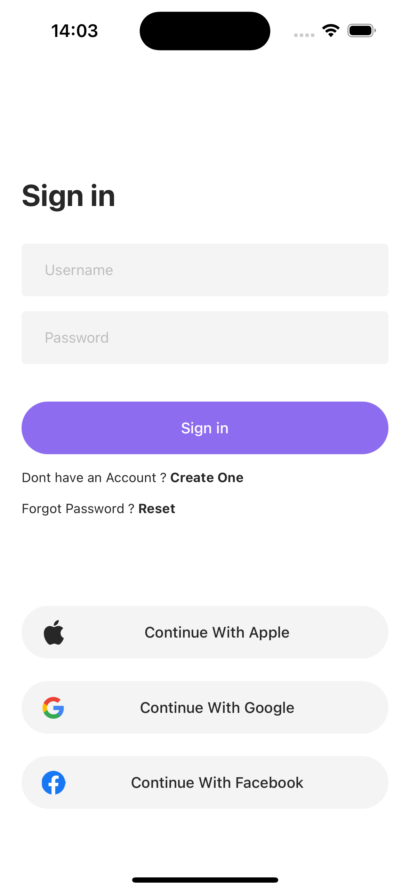

# Store App

<details close>
  <summary>Uygulamaya ait ekran görüntülerini görmek için tıklayın.</summary>
                  
</details>

## Teknoloji

- React Native

## Tools

- React Navigation
- Apisauce
- Redux Toolkit
- MMKV
- React Native Flash Message

## API

- Fake Store API

## Özellikler

- Serviste bulunan kullanıcı bilgileri ile giriş işlemi yapabilmek.
- Ürünlerin listelenmesi ve detayının gösterilmesi.
- Kategori bazında filtreleme işlemi yapılması.
- Sepete ürün ekleyebilmek.
- Adres bilgisi ekleyebilmek, silebilmek ve güncelleyebilmek.
- Kart bilgisi ekleyebilmek, silebilmek ve güncelleyebilmek.

## Kurulum

Bu depoyu yerel makinenizde klonlayın.

```
git clone https://github.com/ibrahimaykutbas/store.git
```

### Hazırlık

Projeyi klonladıktan sonra ilgili dizine gidin.

```
cd store
code .
```

Proje bağımlılıklarını yüklemek için proje dizininde aşağıdaki komutları çalıştırın.

```
npm install
-veya-
yarn
```

Eğer macOS kullanıyorsanız ve iOS işletim sistemine sahip bir cihazda projeyi başlatacaksanız pod'ları yükleyin.

```
cd ios
pod install
```

### Kullanım

Projeyi başlatmak için aşağıdaki komutları kullanın.

```
npm run android
-veya-
npm run ios
```

Bu talimatlar, geliştirme ve test amacıyla yerel makinenizde projenin bir kopyasını hazır ve çalışır hale getirecektir.

## Daha Fazla Bilgi İçin

Daha fazlasını şuradan öğrenebilirsiniz: [React documentation](https://reactnative.dev/)
